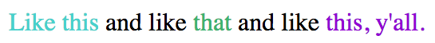

# join() for [`NSAttributedString`](https://developer.apple.com/library/ios/documentation/Cocoa/Reference/Foundation/Classes/NSAttributedString_Class/)

`String` has it:

```swift
" and like ".join(["Like this", "that", "this, y'all."])
```

    "Like this and like that and like this, y'all."

Why not [`NSAttributedString`](https://developer.apple.com/library/ios/documentation/Cocoa/Reference/Foundation/Classes/NSAttributedString_Class/)?

## Extension

```swift
import Foundation

extension NSAttributedString {
  func join(sequence: [NSAttributedString]) -> NSAttributedString {
    if sequence.isEmpty { return NSAttributedString(string: "") }

    var acc = NSMutableAttributedString(attributedString: sequence[0])
    for elem in dropFirst(sequence) {
      acc.appendAttributedString(self)
      acc.appendAttributedString(elem)
    }
    return NSAttributedString(attributedString: acc)
  }
}
```

## Example

```swift
NSAttributedString(string: " and like ").join(
  ["Like this", "that", "this, y'all."].map({
    string -> NSAttributedString in
    let color = UIColor(
      red: CGFloat(drand48()),
      green: CGFloat(drand48()),
      blue: CGFloat(drand48()),
      alpha: 1.0)
    return NSAttributedString(
      string: string,
      attributes: [NSForegroundColorAttributeName: color])
  }))
```


